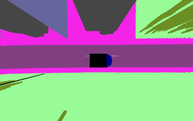

## Inverse Perspective Mapping to Bird's-Eye-View

This script can be used to recreate a Bird's-Eye-View from camera images using Inverse Perspective Mapping.

### Usage
```
usage: ipm.py [-h] [-wm WM] [-hm HM] [-r R]
              [--drone DRONE] [--batch]
              [--output OUTPUT]
              [CAM IMG [CAM IMG ...]]

Warps camera images to the plane z=0 in the world frame.

positional arguments:
  CAM IMG          camera config file and image file

optional arguments:
  -h, --help       show this help message and exit
  -wm WM           output image width in [m]
  -hm HM           output image height in [m]
  -r R             output image resolution in [px/m]
  --drone DRONE    camera config file of drone to map to
  --batch          process folders of images instead of single images
  --output OUTPUT  output directory to write transformed images to
  --cc             use with color-coded images to enable NN-interpolation
  -v               only print homography matrices
```

### Example
#### Generate and display BEV from segmented surround camera images, adjust output image size to match drone intrinsics
```bash
./ipm.py --cc --drone droneCameraConfig.yaml front.yaml front.png rear.yaml rear.png left.yaml left.png right.yaml right.png
```

#### Generate and export BEVs from multiple pairs of front and rear images
```bash
./ipm.py --batch --output output/ frontCameraConfig.yaml frontImages/ rearCameraConfig.yaml rearImages/
```

### How it works

The relationship between world coordinates  and the image pixels  world points get projected onto is given by the projection matrix :

<p align="center">
  
</p>

where we use homogeneous coordinates, which would still need to be normalized.

The projection matrix encodes the camera intrinsics  and extrinsics (rotation  and translation  w.r.t world frame):

<p align="center">
  
</p>

Now, we can also imagine that there exists a transformation  mapping from the road plane to the world frame, s.t.

<p align="center">
  
</p>

Putting these relations together, we can transform from given image coordinates  to coordinates in the road plane  by inverting :

<p align="center">
  
</p>

We have an input image and thus have the image coordinates . The camera intrinsics and extrinsics are assumed to be known and have to be specified via the config file.

What remains is the definition of . In the simplest case we co-locate world frame origin and road plane origin. Then the mapping

<p align="center">
  
</p>

would simply introduce a z-coordinate of 0 when going from road plane to world frame. For a better visualization, one would need to scale between road plane metric coordinates and road image plane pixels as well as do some translation. Have a look at the code for this last step, as the warping to the road plane is already working with the simple mapping.

In the code, the vehicle-frame is used as the world frame.
