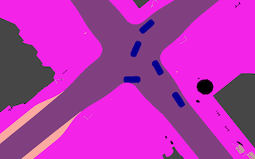
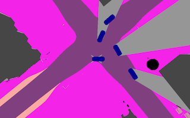

## Drone Footage Occlusion

Vehicle-mounted cameras cannot observe the entire surroundings, e.g. a car behind a truck cannot be seen.  
This script can be used to remove these non-visible areas from segmented drone camera footage.

### Usage
```
usage: occlusion.py [-h] [--batch] [--output OUTPUT]
                    img drone cam [cam ...]

Determines the areas not visible from vehicle cameras and removes them from
drone camera footage.

positional arguments:
  img              segmented drone image
  drone            drone camera config file
  cam              camera config file

optional arguments:
  -h, --help       show this help message and exit
  --batch          process folders of images instead of single images
  --output OUTPUT  output directory to write output images to
```

### Example
```bash
./occlusion.py --batch images/ droneCameraConfig.yaml frontCameraConfig.yaml rearCameraConfig.yaml --output output_images/
```
 

### How it works
From each camera origin defined by a camera configuration file, rays are cast to bordering pixels within the camera's field-of-view. All pixels along the ray are transferred from the input image to the output image. If a pixel color corresponding to a blocking class (e.g. car, building) is observed, that particular ray is stopped, leaving an occluded part in the output image. The blocking objects however are always transferred as a whole by using a flood-filling technique.

### Performance
To speed up batch mode, the script processes multiple images in parallel. Still, there is room for performance optimization, as this is only a relatively basic Python script.
